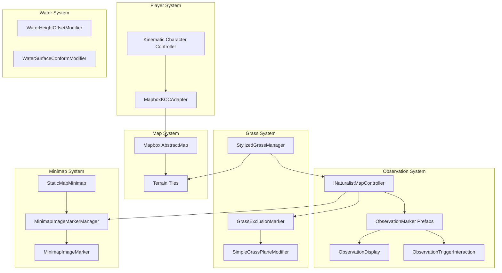
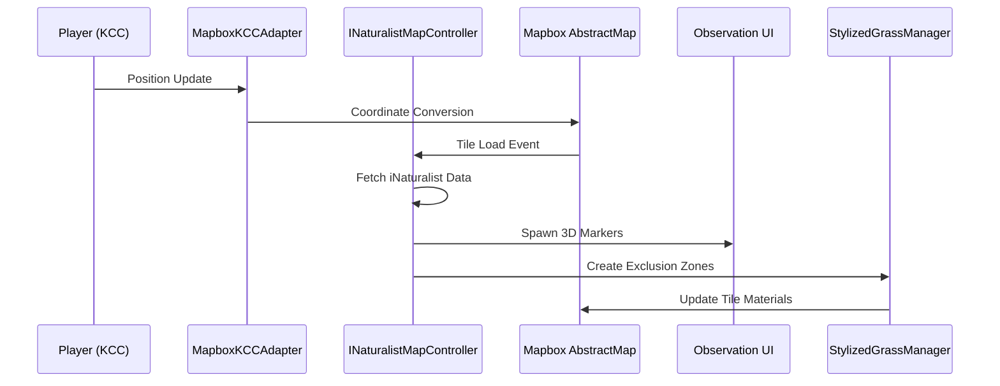
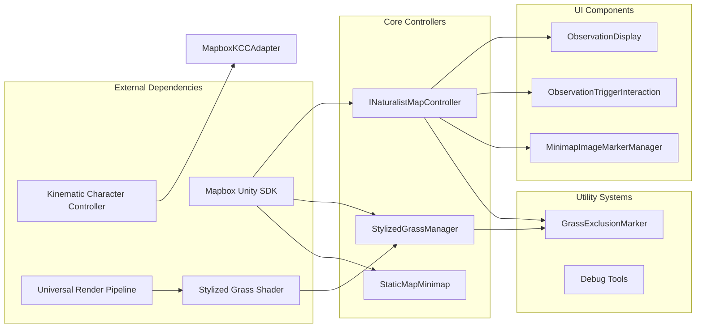

# Project Scripts & Files Inventory
**Unity Mapbox iNaturalist Integration - More-Than-Human Urbanism Prototype**

*Generated: December 2, 2025*

---

## 📁 Project Structure Overview

```
MapBoxiNaturalistTest_02/
├── Assets/
│   ├── Scripts/                    # Custom project scripts (18 active + 6 obsolete)
│   ├── Mapbox/                     # Mapbox SDK (500+ files)
│   ├── KinematicCharacterController/ # Player movement system
│   ├── Materials/                  # Custom materials & textures
│   ├── Prefabs/                   # Observation markers, UI elements
│   ├── Scenes/                    # SampleScene (main scene)
│   └── Resources/                 # Runtime-loaded assets
├── MDs/                           # Documentation (8 files)
├── ProjectSettings/               # Unity configuration
└── Packages/                      # URP, dependencies
```

---

## 🎯 Core System Architecture



---

## 📋 Active Scripts Inventory

### 🗺️ **Core Map & API Integration**

#### `INaturalistMapController.cs` ⭐
- **Type**: MonoBehaviour (Primary Controller)
- **Purpose**: Core system managing iNaturalist API integration
- **Key Features**:
  - API calls to iNaturalist REST endpoint
  - Observation data parsing and filtering
  - 3D marker spawning with coordinate conversion
  - Grass exclusion zone management
  - Distance-based observation sorting
- **Dependencies**: AbstractMap, ObservationDisplay, GrassExclusionMarker
- **Size**: ~500+ lines
- **Status**: ✅ Active, recently optimized (Dec 2)

#### `MapboxKCCAdapter.cs`
- **Type**: MonoBehaviour (Bridge Component)
- **Purpose**: Integrates Kinematic Character Controller with Mapbox coordinate system
- **Key Features**: Player position tracking, coordinate conversion
- **Dependencies**: KCC, AbstractMap
- **Status**: ✅ Active

### 🎮 **Player Interaction System**

#### `ObservationDisplay.cs`
- **Type**: MonoBehaviour (UI Controller)
- **Purpose**: Manages observation information popup display
- **Key Features**: Canvas-based observation details, species information
- **Dependencies**: Canvas, UI elements
- **Status**: ✅ Active

#### `ObservationTriggerInteraction.cs` ⭐
- **Type**: MonoBehaviour (Proximity System)
- **Purpose**: Handles player proximity-based observation interaction
- **Key Features**:
  - 3m trigger radius for canvas visibility
  - 10m hide distance
  - Player detection and UI state management
- **Dependencies**: SphereCollider, Canvas
- **Status**: ✅ Active, recently debugged (Dec 2)

### 🗺️ **Minimap System**

#### `StaticMapMinimap.cs` ⭐
- **Type**: MonoBehaviour (Minimap Controller)
- **Purpose**: Complete minimap implementation using Mapbox Static Images API
- **Key Features**:
  - Dynamic map image generation
  - Smooth panning with player movement
  - Clipping mask viewport system
  - 200m update threshold optimization
- **Dependencies**: RawImage, RectTransform
- **Size**: ~310 lines
- **Status**: ✅ Active, core system

#### `MinimapImageMarkerManager.cs` ⭐
- **Type**: MonoBehaviour (Marker System)
- **Purpose**: Manages 2D sprite markers on minimap
- **Key Features**:
  - PNG emoji sprite rendering
  - Coordinate conversion for 2D display
  - Observation data synchronization via reflection
- **Dependencies**: MinimapImageMarker, INaturalistMapController
- **Status**: ✅ Active, recently fixed color tints (Dec 2)

#### `MinimapImageMarker.cs`
- **Type**: MonoBehaviour (Individual Marker)
- **Purpose**: Individual minimap marker component
- **Key Features**: Sprite display, color preservation (fixed Dec 2)
- **Dependencies**: Image component
- **Status**: ✅ Active

### 🌱 **Vegetation & Environment System**

#### `StylizedGrassManager.cs` ⭐
- **Type**: MonoBehaviour (Grass Controller)
- **Purpose**: Dynamic grass material swapping based on player proximity
- **Key Features**:
  - Player-proximity grass rendering (50-300m configurable)
  - Material swapping between grass and base materials
  - Performance optimization for large tile systems
  - Event-driven updates on tile loading
- **Dependencies**: AbstractMap, Stylized Grass Shader materials
- **Size**: ~180+ lines
- **Status**: ✅ Active, core system

#### `GrassExclusionMarker.cs`
- **Type**: MonoBehaviour (Exclusion System)
- **Purpose**: Creates grass-free zones around observations
- **Key Features**:
  - Bounds-based overlap detection
  - Visual gizmos for debugging
  - Integration with multiple grass systems
- **Dependencies**: SimpleGrassPlaneModifier
- **Status**: ✅ Active, created Dec 2

#### `OptimizedGrassPatchSpawner.cs`
- **Type**: MonoBehaviour (Grass Spawning)
- **Purpose**: Optimized grass patch placement system
- **Key Features**: Performance-optimized spawning algorithm
- **Status**: ✅ Active

### 💧 **Water & Environment Modifiers**

#### `WaterHeightOffsetModifier.cs`
- **Type**: GameObjectModifier (Mapbox Extension)
- **Purpose**: Simple uniform height offset for water surfaces
- **Key Features**: Y-axis offset configuration (0-2 range)
- **Status**: ✅ Created, ready for testing

#### `WaterSurfaceConformModifier.cs`
- **Type**: GameObjectModifier (Mapbox Extension)
- **Purpose**: Advanced water surface terrain conforming
- **Key Features**:
  - Vertex-level terrain height matching
  - Raycast-based elevation detection
  - Realistic water pooling simulation
- **Size**: ~105 lines
- **Status**: ✅ Created, ready for testing

#### `WaterConformToTerrainModifier.cs`
- **Type**: GameObjectModifier
- **Purpose**: Alternative water terrain conforming approach
- **Status**: ✅ Active

#### `WaterRenderQueueModifier.cs`
- **Type**: GameObjectModifier
- **Purpose**: Render queue optimization for water transparency
- **Status**: ✅ Active

### 🎨 **Visual & VFX Systems**

#### `AreaVFXManager.cs`
- **Type**: MonoBehaviour (VFX Controller)
- **Purpose**: Area-based visual effects management
- **Key Features**: Location-based VFX triggering
- **Status**: ✅ Active

#### `WeatherVFXController.cs`
- **Type**: MonoBehaviour (Weather System)
- **Purpose**: Weather and atmospheric effects
- **Key Features**: Dynamic weather simulation
- **Status**: ✅ Active

### 🔧 **Utility & Debug Systems**

#### `TerrainMaterialFixer.cs`
- **Type**: MonoBehaviour (Diagnostic Tool)
- **Purpose**: Material debugging and diagnostic information
- **Key Features**:
  - Terrain material analysis
  - URP compatibility checking
  - Diagnostic reporting
- **Size**: ~135 lines
- **Status**: ✅ Active (diagnostic tool)

#### `DebugCoordinateOverlay.cs`
- **Type**: MonoBehaviour (Debug Tool)
- **Purpose**: Real-time coordinate display overlay
- **Key Features**: World position debugging, lat/lng display
- **Status**: ✅ Active

#### `ObservationPositionTracker.cs`
- **Type**: MonoBehaviour (Tracking System)
- **Purpose**: Observation position monitoring and analytics
- **Key Features**: Position tracking and data collection
- **Status**: ✅ Active

---

## 🏗️ **Mapbox GameObject Modifiers**

### Core Mapbox Extensions

#### `SpawnInsideModifier.cs` ⭐
- **Type**: GameObjectModifier (Mapbox System)
- **Purpose**: Spawns prefabs inside polygon boundaries (parks, landuse areas)
- **Key Features**:
  - Bounding box-based spawning
  - Raycast terrain detection
  - Configurable spawn rate and max objects
  - Integration with FSIM_PARKS asset
- **Status**: ✅ Active, restored to original (Dec 2)

#### `SpawnInsideModifier_Fixed.cs` ⭐
- **Type**: GameObjectModifier (Enhanced Version)
- **Purpose**: Enhanced version with accurate boundary detection
- **Key Features**:
  - Mesh collider-based inside testing
  - Advanced density controls (multiplier, min distance)
  - Strict boundary tolerance configuration
  - Position tracking for spacing
- **Size**: ~200+ lines
- **Status**: ✅ Available as alternative implementation

### Custom Modifiers

#### `SimpleGrassPlaneModifier.cs`
- **Type**: GameObjectModifier
- **Purpose**: Landuse-based grass plane spawning with exclusion zones
- **Key Features**:
  - Observation overlap detection
  - Layer-based collision avoidance
  - GrassExclusionMarker integration
- **Status**: ✅ Active, enhanced Dec 2

### Mapbox Custom Modifiers Directory

#### `Mapbox_Custom_Modifiers/C_TextureModifier.cs`
- **Type**: MonoBehaviour (Custom Modifier)
- **Purpose**: Custom texture application modifier
- **Status**: ✅ Active

---

## 📁 **Obsolete Files (_Obsolete Directory)**

### Deprecated Grass Systems
- `DynamicGrassManager.cs` - Point Grass Renderer attempts
- `StylizedGrassManager_OLD.cs` - Previous grass manager version
- `StylizedGrassManager.cs.txt` - Backup of corrupted version
- `GrassPatchSpawner.cs` - Early grass spawning approach
- `PointGrassTileModifier.cs` - Failed Point Grass implementation
- `StylizedGrassLanduseModifier.cs` - Deprecated landuse grass
- `GrassSpawnerModifier.cs` - Early spawning system

**Total Obsolete**: 7 scripts (~800+ lines preserved for reference)

---

## 🎯 **Script Relationships & Data Flow**

### Primary Data Flow



### Component Dependencies



---

## 📊 **Statistics & Metrics**

### Code Metrics
- **Total Active Scripts**: 24
- **Total Obsolete Scripts**: 7  
- **Total Lines of Code**: ~3,500+ (estimated)
- **Core System Scripts**: 8
- **UI/Interaction Scripts**: 4
- **Utility/Debug Scripts**: 5
- **Mapbox Extensions**: 7

### System Complexity
- **Primary Controllers**: 3 (API, Grass, Minimap)
- **MonoBehaviour Components**: 21
- **GameObjectModifiers**: 6
- **External Dependencies**: 4 major packages
- **Documentation Files**: 8

### Development Timeline
- **Core Systems**: Nov 27-30, 2025
- **Grass Integration**: Nov 30 - Dec 1, 2025
- **API Optimization**: Dec 2, 2025
- **System Debugging**: Dec 2, 2025

---

## 🔗 **Key Script Interactions**

### 1. **Observation Lifecycle**
```
INaturalistMapController → ObservationDisplay → ObservationTriggerInteraction
                       ↓
                  GrassExclusionMarker → SimpleGrassPlaneModifier
                       ↓
              MinimapImageMarkerManager → MinimapImageMarker
```

### 2. **Grass System Chain**
```
StylizedGrassManager → AbstractMap Tiles → Material Swapping
                   ↓
            GrassExclusionMarker → Bounds Checking
                   ↓
         SimpleGrassPlaneModifier → Spawn Prevention
```

### 3. **Player-Driven Updates**
```
Player Movement → MapboxKCCAdapter → AbstractMap
                                  ↓
                            INaturalistMapController → API Calls
                                  ↓
                            StaticMapMinimap → Image Updates
                                  ↓
                            StylizedGrassManager → Material Updates
```

---

## 🎯 **Critical Dependencies**

### External Packages
1. **Mapbox Unity SDK v2.1.1** - Core mapping functionality
2. **Universal Render Pipeline 14.0.11** - Rendering pipeline
3. **Kinematic Character Controller** - Player movement
4. **Stylized Grass Shader** - Vegetation rendering

### Internal Dependencies
1. **INaturalistMapController** - Central hub for observation data
2. **AbstractMap** - Mapbox tile system integration
3. **Canvas Systems** - UI display framework
4. **Layer System** - Physics separation (Observations, Grass, GrassExclusion)

### Asset Dependencies
- **FSIM_PARKS.asset** - SpawnInsideModifier configuration
- **Materials/** - URP-compatible materials
- **Prefabs/** - Observation markers, UI elements
- **PNG Sprites** - Minimap emoji markers

---

## 🚀 **System Status Summary**

### ✅ **Fully Operational**
- Mapbox tile loading & player navigation
- iNaturalist API integration with optimized filters
- 3D observation markers with proximity interaction
- Minimap system with sprite-based markers
- Grass exclusion system preventing overlaps
- Material-based grass rendering system

### 🔧 **Ready for Testing**
- Water surface modifiers (offset & conform approaches)
- Enhanced SpawnInsideModifier_Fixed version
- Weather VFX system

### 📋 **Future Enhancements**
- Performance profiling and optimization
- User testing and feedback integration
- Additional landuse-based features
- Enhanced debugging and analytics

---

**Document Status**: Complete Inventory  
**Last Updated**: December 2, 2025  
**Total Files Documented**: 31 active scripts + 7 obsolete + 4 major dependencies